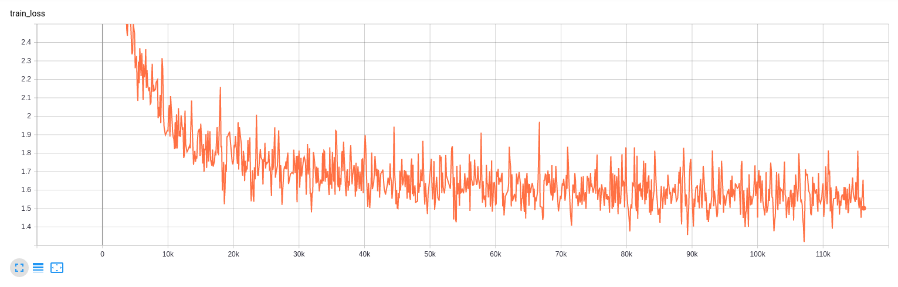

# Homework 9

1. Training takes about 2 days per 100k steps on V100s.  Extrapolating out to 300k steps results in about 6 days.

2. The network is approaching convergence.  From Dima's Tensorboard, it looks like BLEU can get a little bit above 0.38 but not by much.


3. It does not look like the model is overfitting.  Both eval and training loss are fairly level around 1.6.



4. GPUs are working at 100%.


5. Network I/O is at about 200 MB/s.  This is not a bottleneck since the images have 1000 MB/s connections.


6. The learning rate rises for 8000 steps and then decreases.  
```python
  "lr_policy": transformer_policy,
  "lr_policy_params": {
    "learning_rate": 2.0,
    "warmup_steps": 8000,
    "d_model": d_model,
  }
```


7. The training data is 14GB.

8. The meta file contains information about the graph.  The data file contains all the values of the variables.  The index file contains checkpoint indexing information.

9. One checkpoint is about 828MB.

10. Global steps per second hovers just below 0.6.  That means a single step takes about 1.7 seconds.


11. Network utilization is not limiting the data available to the GPUs.
