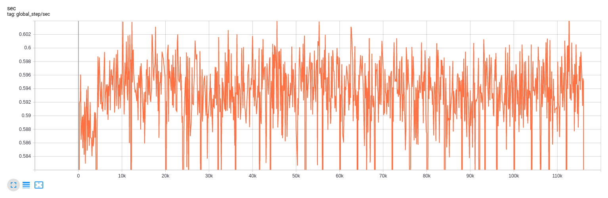
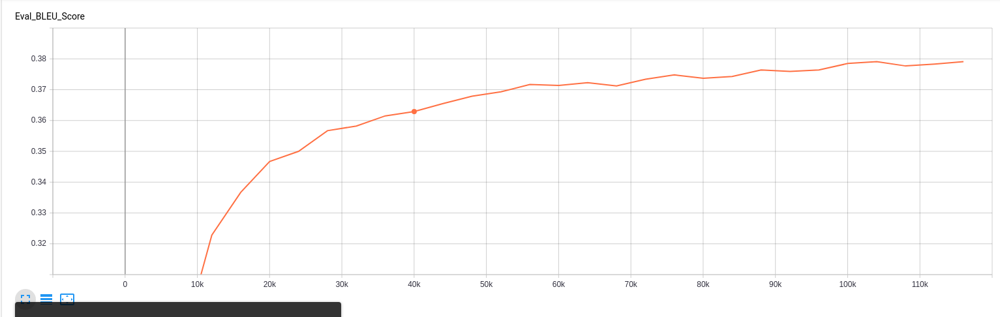
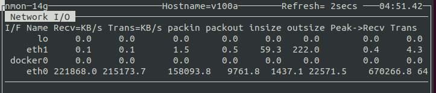
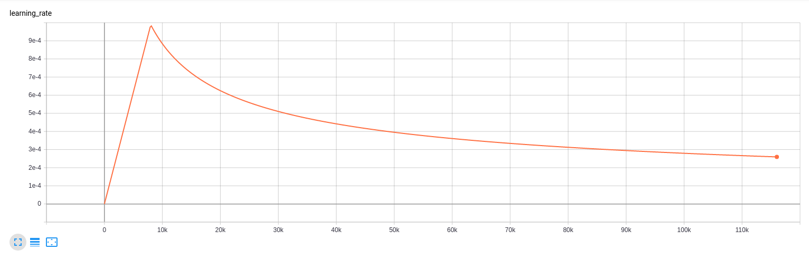

# Homework 9

1. Training takes about 280 minutes per 10k steps on V100s.  Extrapolating out to 300k steps results in about 5.8 days.


2. At the time of writing this, the model is absolutely not fully trained.  BLEU score is actually decreasing, but so is training loss are still dropping.


3. It does not look like the model is overfitting.  From Dima's Tensorboard, it looks like the eval loss will continue to drop.


4. GPUs are working at 100%.


5. Network I/O is at about 200 MB/s.  This is not a bottleneck since the images have 1000 MB/s connections.


6. The learning rate rises for 8000 steps and then decreases.  
```python
  "lr_policy": transformer_policy,
  "lr_policy_params": {
    "learning_rate": 2.0,
    "warmup_steps": 8000,
    "d_model": d_model,
  }
```


7. The training data is 14GB.

8. The meta file contains information about the graph.  The data file contains all the values of the variables.  The index file contains checkpoint indexing information.

9. One checkpoint is about 828MB.

10. A step takes a little less than 2 seconds.

11. 
